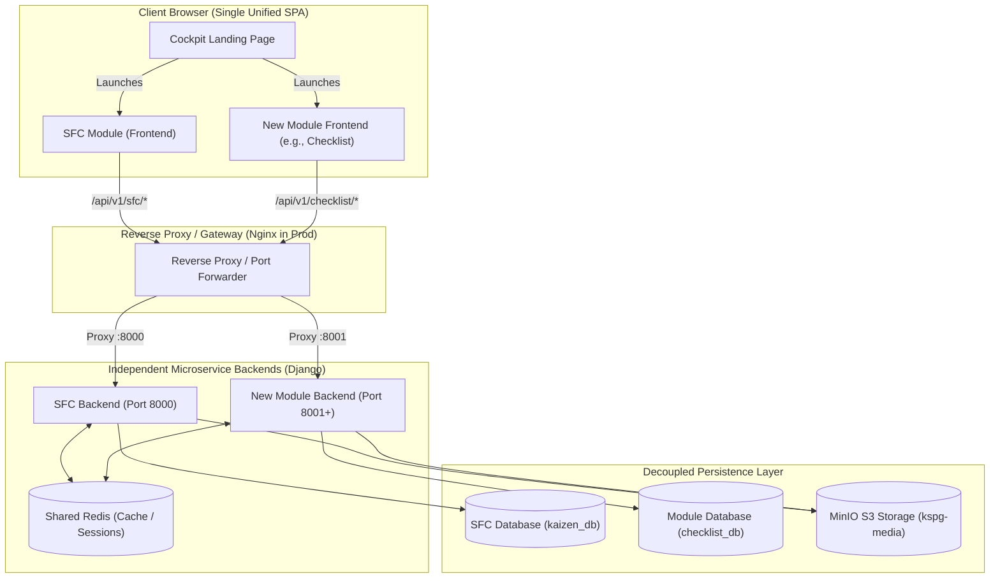

# KSPG Cockpit — External Module Integration Specification & Agent Contract

> **Target Audience:** Autonomous Coding Agents & Software Engineers building new modules (e.g., *Checklist*, *Inventory*, *TPM Maintenance*, *Quality & Metrology*) intended to plug into the **KSPG Cockpit Enterprise Gateway**.
> 
> **Architectural Paradigm:** **Monolithic Unified Frontend + Independent Microservice Backends**  
> (Single React 18 SPA Shell + Decoupled Django REST Framework services connected via API Gateway/Nginx).

---

## 1. Architectural Architecture & High-Level Topology

The **KSPG Cockpit** is an enterprise manufacturing portal. The client loads a single unified React application (the Cockpit Shell). From the Cockpit Landing Page, users launch specialized operational modules (*SFC Intelligence*, *Checklist*, etc.).



---

## 2. The 3 Non-Negotiable Integration Pillars

Any agent or developer building a new module **MUST** adhere to these 3 rules to prevent breaking production or requiring architectural rewrites during merging.

---

### Pillar 1: Authentication & Identity Contract (Single Sign-On)

Do **NOT** implement an independent user registration or login page inside your module. The user authenticates **once** on the Cockpit Landing Shell. Your module backend will receive tokens/sessions generated by the Cockpit.

#### 1.1 Shared Secret Key (Critical)
Both the KSPG Core Backend and your Module Backend must use the exact same cryptographic secret:
```python
# settings.py
SECRET_KEY = config('SECRET_KEY', default='django-insecure-development-key-for-kaizen-sfc-2026')
```
*If the keys differ, your backend will reject the user's JWT with a `401 Signature verification failed` error.*

#### 1.2 JWT Authentication Configuration
Use `rest_framework_simplejwt` configured to match the Cockpit token structure:
```python
# settings.py
REST_FRAMEWORK = {
    'DEFAULT_AUTHENTICATION_CLASSES': (
        'rest_framework_simplejwt.authentication.JWTAuthentication',
        'rest_framework.authentication.SessionAuthentication',
    ),
    'DEFAULT_PERMISSION_CLASSES': (
        'rest_framework.permissions.IsAuthenticated',
    ),
}

SIMPLE_JWT = {
    'AUTH_HEADER_TYPES': ('Bearer',),
    'SIGNING_KEY': SECRET_KEY,
    'ALGORITHM': 'HS256',
}
```

#### 1.3 User Identity Payload
The decoded token payload passed to your backend contains the following standard claims:
```json
{
  "token_type": "access",
  "exp": 1774167300,
  "user_id": 14,
  "username": "initiator_pune",
  "email": "initiator@kspg.local",
  "role_category": "initiator",
  "plant_id": "PUNE_PLANT_01",
  "is_superadmin": false
}
```
* **Stateless Operation:** Your module backend does **not** need to duplicate the master `CustomUser` table. You can inspect `request.user` or unpack `request.auth` directly to get the user's ID, username, and role.
* **Foreign Keys:** If your Django models need to record who created an item, store `created_by_id = models.IntegerField(db_index=True)` or `created_by_username = models.CharField(max_length=150)`. Do **not** create a hard SQL `ForeignKey` to the other project's User table.

---

### Pillar 2: Network Ports, Routing & CORS

#### 2.1 Port Allocation Matrix (Development)
| Component | Local Development URL | Production Path (Nginx) |
|---|---|---|
| **Cockpit Frontend (Vite SPA)** | `http://localhost:5173` | `https://cockpit.company.com/` |
| **SFC Core Backend (Django)** | `http://localhost:8000` | `https://cockpit.company.com/api/v1/` |
| **Checklist Backend (Django)** | `http://localhost:8001` | `https://cockpit.company.com/api/v1/checklist/` |
| **Future Module N (Django)** | `http://localhost:8002+` | `https://cockpit.company.com/api/v1/<module_slug>/` |

#### 2.2 Endpoint Prefix Convention
Every route in your module backend **MUST** be scoped under `/api/v1/<module_slug>/`.
```python
# config/urls.py in your module
from django.urls import path, include

urlpatterns = [
    # Health check for gateway monitor
    path('api/v1/checklist/health/', include('checklist.health_urls')),
    # Module APIs
    path('api/v1/checklist/', include('checklist.urls')),
]
```

#### 2.3 CORS Configuration (Development)
Ensure `django-cors-headers` allows credentials from the Vite host:
```python
# settings.py
INSTALLED_APPS += ['corsheaders']
MIDDLEWARE = ['corsheaders.middleware.CorsMiddleware', ...]

CORS_ALLOWED_ORIGINS = [
    "http://localhost:5173",
    "http://127.0.0.1:5173",
]
CORS_ALLOW_CREDENTIALS = True
CORS_ALLOW_HEADERS = [
    'accept',
    'authorization',
    'content-type',
    'user-agent',
    'x-csrftoken',
    'x-requested-with',
]
```

---

### Pillar 3: Database & MinIO Storage Isolation

#### 3.1 Database Isolation
* **Separate Database:** Use a dedicated PostgreSQL database (e.g., `checklist_db` or schema `checklist`).
* **Zero Cross-Database Joins:** Never attempt a direct SQL `JOIN` between SFC tables (like `kaizens_kaizen`) and your module's tables.
* **Loose Coupling:** If a checklist refers to an SFC item, store it as a reference:
  ```python
  class ChecklistItem(models.Model):
      title = models.CharField(max_length=255)
      linked_source_module = models.CharField(max_length=50, blank=True, null=True) # e.g. "kaizen" or "5s"
      linked_source_id = models.CharField(max_length=100, blank=True, null=True)     # e.g. "KAI-2026-0042"
  ```

#### 3.2 MinIO / S3 Media Storage
All modules share the same MinIO storage cluster. To prevent collision:
* **Prefix all uploaded files** with your module name:
  ```python
  def checklist_attachment_path(instance, filename):
      return f"checklist/attachments/{instance.id}/{filename}"

  class ChecklistAttachment(models.Model):
      file = models.FileField(upload_to=checklist_attachment_path)
  ```

---

## 3. Frontend Architecture & Contract (React / Vite)

When coding the frontend for a new module, design it as an **isolated package** that can be dropped into the Cockpit's `src/` directory.

### 3.1 Folder Structure
Inside your frontend repo, group all code within a single domain directory:
```text
src/
└── checklist/                      <-- Everything for this module lives here
    ├── api/                        <-- Axios / fetch callers
    │   └── checklistClient.ts
    ├── components/                 <-- Module-specific UI components
    │   ├── ChecklistTable.tsx
    │   └── ChecklistAuditModal.tsx
    ├── hooks/                      <-- React hooks
    ├── types/                      <-- TypeScript interfaces
    │   └── index.ts
    └── ChecklistModule.tsx         <-- Single Top-Level Entry Wrapper
```

### 3.2 Top-Level Entrypoint Contract (`ChecklistModule.tsx`)
The root component of your module **MUST** implement this exact interface:

```tsx
// src/checklist/ChecklistModule.tsx
import React from 'react';
import { ArrowLeft, LogOut } from 'lucide-react';

export interface AuthUser {
  id: number | string;
  username: string;
  email: string;
  full_name?: string;
  role_category: 'initiator' | 'coordinator' | 'committee' | 'admin' | 'superadmin';
  is_superadmin?: boolean;
}

export interface ModuleProps {
  currentUser: AuthUser | null;
  onBackToLanding: () => void;           // Returns user to Cockpit Gateway
  onLogout: () => void;                  // Ends user session
  onNavigateToSuperadmin?: () => void;   // Admin shortcut if role permits
}

export default function ChecklistModule({
  currentUser,
  onBackToLanding,
  onLogout
}: ModuleProps) {
  return (
    <div className="min-h-screen bg-[#0E1626] text-[#F2F2F2]">
      {/* Top Header Shell */}
      <header className="h-16 border-b border-[#F2F2F2]/10 bg-[#191B40]/80 backdrop-blur-md px-6 flex items-center justify-between sticky top-0 z-30">
        <div className="flex items-center gap-4">
          <button
            onClick={onBackToLanding}
            className="flex items-center gap-2 px-3 py-1.5 rounded-xl bg-[#0E1626] border border-[#F2F2F2]/15 text-xs font-mono font-bold hover:bg-[#4C7FFF] hover:border-[#4C7FFF] transition"
          >
            <ArrowLeft className="w-4 h-4" />
            <span>BACK TO COCKPIT</span>
          </button>
          <h1 className="text-lg font-black tracking-tight">Checklist System</h1>
        </div>

        <div className="flex items-center gap-3">
          <span className="text-xs font-mono text-[#F2F2F2]/60">
            {currentUser?.full_name || currentUser?.username} ({currentUser?.role_category})
          </span>
          <button
            onClick={onLogout}
            className="p-2 text-rose-300 hover:bg-rose-950/40 rounded-xl transition"
            title="Logout"
          >
            <LogOut className="w-4 h-4" />
          </button>
        </div>
      </header>

      {/* Module Body */}
      <main className="p-6 max-w-7xl mx-auto">
        {/* Module Content */}
      </main>
    </div>
  );
}
```

### 3.3 Design System & Theme Tokens
To ensure a consistent look and feel with the Cockpit:
* **Background Deep:** `#0E1626`
* **Card / Container:** `#191B40` (often with `backdrop-blur-xl` and `border border-[#F2F2F2]/10`)
* **Primary Brand / Action:** `#4C7FFF` (Cockpit Blue)
* **Secondary Accents:** Emerald `#10B981` (Success/Active), Rose `#F43F5E` (Danger/Stop), Amber `#F59E0B` (Pending/Alert)
* **Text Primary:** `#F2F2F2`
* **Typography:** Inter, Hanken Grotesk, or standard Tailwind `font-sans` with `font-mono` for IDs, status badges, and metrics.

### 3.4 API Client Configuration
Never hardcode API URLs. Always use an environment variable that defaults to the local development port or the production subpath:

```typescript
// src/checklist/api/checklistClient.ts
const API_BASE = import.meta.env.VITE_CHECKLIST_API_URL || 'http://localhost:8001/api/v1/checklist';

export async function fetchChecklists() {
  // Retrieve the shared JWT token stored by Cockpit Login
  const token = localStorage.getItem('kspg_access_token') || sessionStorage.getItem('kspg_access_token');

  const response = await fetch(`${API_BASE}/items/`, {
    headers: {
      'Content-Type': 'application/json',
      ...(token ? { 'Authorization': `Bearer ${token}` } : {})
    }
  });

  if (response.status === 401) {
    // Session expired; trigger re-auth
    window.dispatchEvent(new CustomEvent('kspg:unauthorized'));
  }

  return response.json();
}
```

---

## 4. Production Nginx Gateway Template

When deploying multiple backend services on the company server, use this standard Nginx reverse-proxy configuration:

```nginx
server {
    listen 80;
    server_name cockpit.company.com;

    # 1. Cockpit Frontend SPA
    location / {
        root /var/www/cockpit_frontend/dist;
        index index.html;
        try_files $uri $uri/ /index.html;
    }

    # 2. SFC Intelligence Backend (Port 8000)
    location /api/v1/sfc/ {
        proxy_pass http://127.0.0.1:8000;
        proxy_set_header Host $host;
        proxy_set_header X-Real-IP $remote_addr;
        proxy_set_header X-Forwarded-For $proxy_add_x_forwarded_for;
        proxy_set_header X-Forwarded-Proto $scheme;
    }

    # 3. Checklist Backend (Port 8001)
    location /api/v1/checklist/ {
        proxy_pass http://127.0.0.1:8001;
        proxy_set_header Host $host;
        proxy_set_header X-Real-IP $remote_addr;
        proxy_set_header X-Forwarded-For $proxy_add_x_forwarded_for;
        proxy_set_header X-Forwarded-Proto $scheme;
    }

    # 4. MinIO Object Storage
    location /media/ {
        proxy_pass http://127.0.0.1:9000;
        proxy_set_header Host $host;
    }
}
```

---

## 5. Merging Checklist (Step-by-Step)

When the external agent or developer completes the module:

1. **Frontend Drop-in:**
   - Copy `src/checklist/` from the checklist repo into `structure/Frontend/src/checklist/`.
   - In `structure/Frontend/src/main.tsx`:
     - Update view state: `type ViewState = 'landing' | 'sfc' | 'checklist' | 'superadmin';`
     - Add conditional render for `<ChecklistModule currentUser={currentUser} onBackToLanding={() => setCurrentView('landing')} onLogout={handleSessionEnd} />`.
   - In `structure/Frontend/src/LandingPage/LandingPage.tsx`:
     - Change the "Checklist" card from staged to active.
     - Attach `onLaunchChecklist={() => setCurrentView('checklist')}` to its button.

2. **Backend Setup:**
   - Run the Checklist Django backend on its dedicated port (`8001`).
   - Ensure the `.env` has the same `SECRET_KEY` as SFC.
   - Run migrations on its own database: `python manage.py migrate`.

3. **Verification:**
   - Log in via the Cockpit login screen.
   - Click "Launch Sequence" on the Checklist card.
   - Verify that data loads from `:8001` with no authentication errors.
   - Click "← Back to Cockpit" to ensure smooth navigation back to the gateway.
